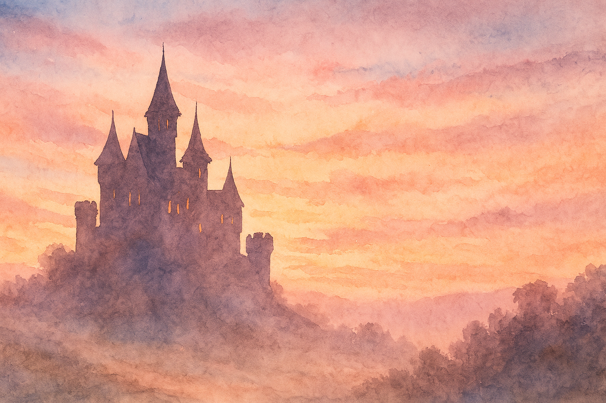
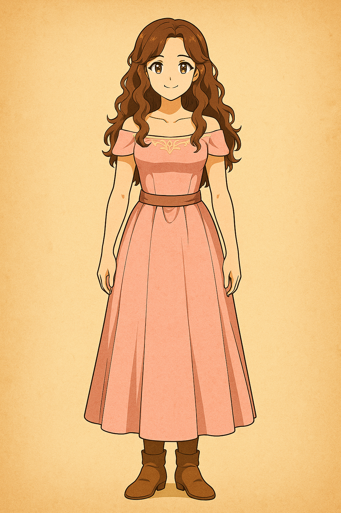
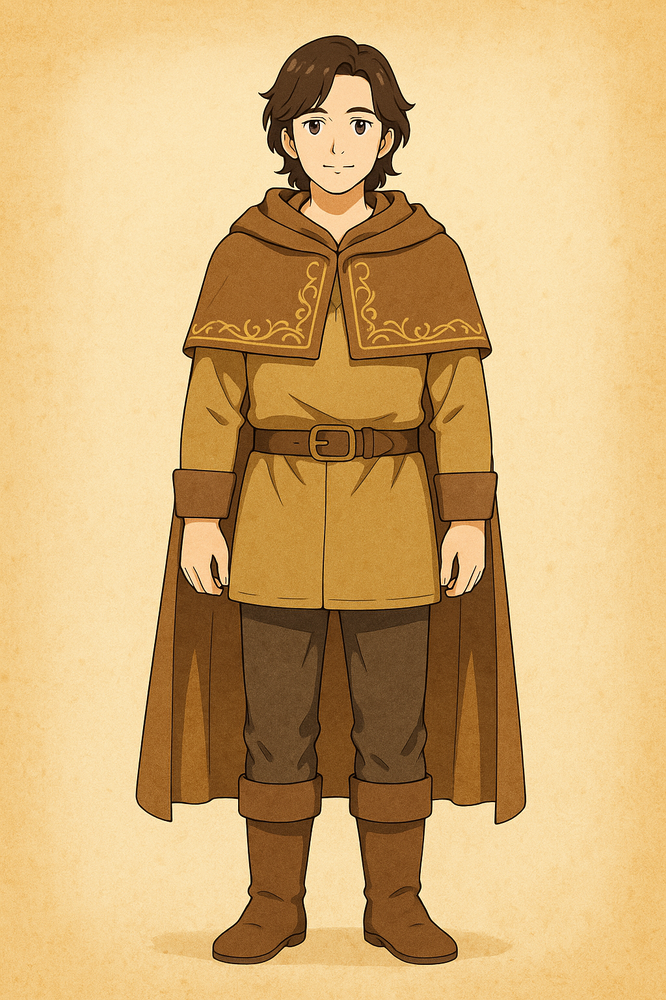
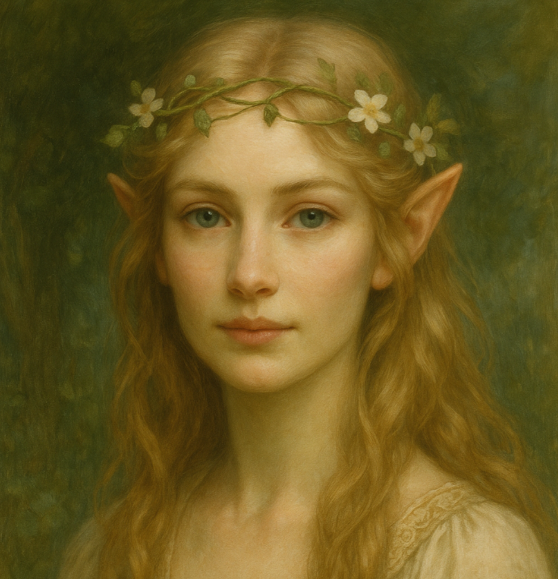
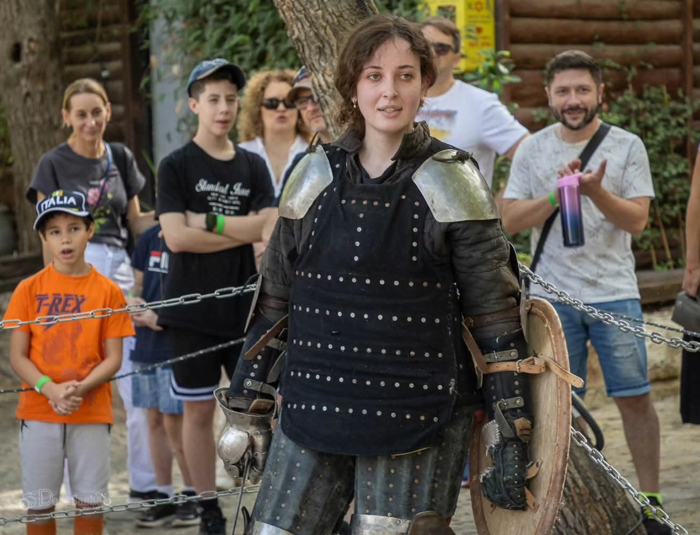

# ⚔️ The Camelot Protocol: Danielle & Vlad's Interactive Wedding

*A fully gamified, narrative-driven, multi-language web experience built to turn a standard wedding RSVP into an immersive Arthurian adventure.*

## 🏰 Explore the Experience
* **Live Portal:** [Enter the Wedding Site](https://ladyfaye1998.github.io/Danielle-and-Vlad-Wedding-Site/)

### 📸 The Aftermath
Want to see more about the wedding?: [Here are the photos!](https://idanhassonphotographer.pic-time.com/-2207)

### 🎥 The Wedding Video
*(Click to watch on YouTube!)*
 

## 📖 The Concept
Why send a boring paper invitation when you can make your guests work for it? 

The site supported 3 languages: Hebrew, English, and Russian. To receive an invitation, the user had to pass a game to get an invite either from me, the Bride (Danielle), or the Groom (Vlad). Both games start and end with a small graphic novel scene where you dialogue with the main character.

---

## 🎮 The Quests

### 🫖 Danielle's Flow
Danny is nervous because of the wedding, and she really loves tea. You must make the perfect tea for her to approve it to get an invite.

 
 

### 🗡️ Vlad's Flow
Vlad woke up in the morning, and a goblin stole the rings! You must guide Vlad to follow and catch the goblin (platformer game) then beat him in trivia.

 

---

## 🤖 Features & Shenanigans

* **Saeriel (AI Fairy Assistant):** Saeriel was our AI fairy assistant. She knew everything about the evening, menu, games, and contact information. Needed anything? You could have asked her, but now she won't answer because I deactivated her to not pay for the API, oopsie.
* **Radio Camelot:** We had a wedding radio station hosted on [airadiobot.com](https://airadiobot.com/) (which is currently disabled to not pay). It had Camelot stories, stories about us, interviews, and music.
* **The Prologue:** A small timeline telling our story.
* **The Countdown:** A countdown that doesn't count anymore because thank god we are already married.
* **RSVP:** Regular stuff that was updating my Google Drive and registry to shuttles, the regular stuff.

 

---

## 📜 Beyond the Screen: The Real-World Lore
The story didn't end there. We had wedding-themed perfume, a journal, and live games. And an Excalibur made especially for us (to marry me, Vlad had to duel and take a sword out of a stone). 

Yes - I wrote this ceremony.

### 📖 The Wedding Journal 
[📘 Click here to read the full lore journal](./assets/Wedding%20Journal%20V&D.pdf)

### 🍽️ The Feast Menu
[📜 Click here to view the menu](./assets/menu.pdf)

---

## 🤝 Let's Build a Story Together

Have/want a unique concept? Talk to me. DM for a price offer (just story, just branding, just something, we will talk, or even just a concept site). Let's build a story-driven experience together.

---

### ⚔️ P.S. The Lore Continues...
The Camelot aesthetic wasn't just a one-day wedding theme. I hold an MA in Celtic Studies from the University of Wales Trinity Saint David, so I take my medieval history quite seriously. 

So seriously, in fact, that after the wedding, the natural next step was taking up **Buhurt** (full-contact historical medieval combat in actual steel armor). 

*(Click the image to see the armor)*
 

